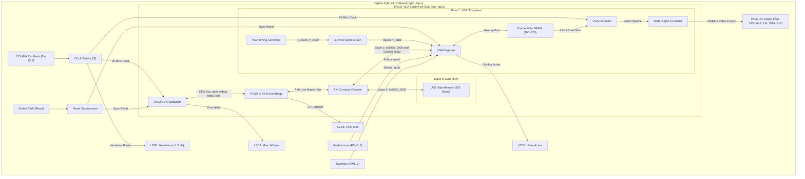
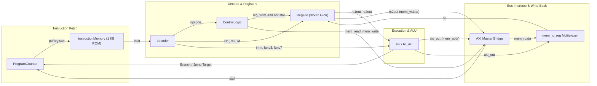

# RV32I Processor Core with AXI-4 Interconnect & VGA Subsystem

A complete 32-bit RISC-V (RV32I Base Integer ISA) System-on-Chip (SoC) implemented in synthesizable Verilog HDL. The system integrates a custom single-cycle RV32I microprocessor core, an AXI4-Lite bus interconnect, memory-mapped I/O, an on-chip dual-port video framebuffer controller, and an interactive bare-metal Ping Pong game deployed to the **Digilent Zybo Z7-10** FPGA using the open-source **F4PGA / SymbiFlow** toolchain.

---

## Table of Contents

- [Overview](#overview)
- [System Architecture](#system-architecture)
- [Memory Map & Interconnect](#memory-map--interconnect)
- [Microprocessor Core (RV32I)](#microprocessor-core-rv32i)
  - [Datapath Architecture](#datapath-architecture)
  - [Supported Instruction Set](#supported-instruction-set)
  - [Control Logic Unit](#control-logic-unit)
  - [Core Module Breakdown](#core-module-breakdown)
- [On-Chip Interconnect & AXI4-Lite Bridge](#on-chip-interconnect--axi4-lite-bridge)
  - [RV32I to AXI4-Lite Bridge](#rv32i-to-axi4-lite-bridge)
  - [AXI Crossbar Decoder](#axi-crossbar-decoder)
  - [AXI Data Memory](#axi-data-memory)
- [VGA Graphics Controller Subsystem](#vga-graphics-controller-subsystem)
  - [Resolution & 4x Hardware Pixel Scaling](#resolution--4x-hardware-pixel-scaling)
  - [Framebuffer Architecture & BRAM Footprint](#framebuffer-architecture--bram-footprint)
  - [Memory-Mapped VGA Registers](#memory-mapped-vga-registers)
  - [Pmod RGB111 Physical Interface](#pmod-rgb111-physical-interface)
- [FPGA Implementation (Digilent Zybo Z7-10)](#fpga-implementation-digilent-zybo-z7-10)
  - [Clock & Reset Architecture](#clock--reset-architecture)
  - [Diagnostic LEDs & Peripheral Pinout](#diagnostic-leds--peripheral-pinout)
- [Bare-Metal Application: Ping Pong Game](#bare-metal-application-ping-pong-game)
  - [Game Mechanics & Features](#game-mechanics--features)
  - [Flicker-Free Rendering Engine](#flicker-free-rendering-engine)
  - [Assembling & Updating Software](#assembling--updating-software)
- [Build System & Toolchain Guide](#build-system--toolchain-guide)
  - [Makefile Targets](#makefile-targets)
  - [Synthesizing & Generating Bitstream (F4PGA)](#synthesizing--generating-bitstream-f4pga)
  - [Board Programming (openFPGALoader)](#board-programming-openfpgaloader)
- [Verification & Simulation](#verification--simulation)
  - [Testbench Suite](#testbench-suite)
  - [Running SoC Simulation](#running-soc-simulation)
- [Repository File Structure](#repository-file-structure)
- [License](#license)

---

## Overview

This project implements an end-to-end computer system on an FPGA, spanning from CPU instruction decoding to real-time video generation and physical user I/O:

- **CPU Core**: 32-bit single-cycle RISC-V (RV32I) processor core with pipeline stall support for memory transactions.
- **Bus Standard**: Standard AXI4-Lite protocol decoupling the CPU pipeline from peripheral timing.
- **Memory Architecture**: Separate 1 KB local Instruction Memory (ROM) and memory-mapped AXI Data Memory (RAM).
- **Video Subsystem**: Custom hardware VGA controller generating standard 640x480 @ 60 Hz timing, featuring a 160x120 internal frame buffer with 4x hardware pixel replication and single Pmod RGB111 output.
- **Interactive Bare-Metal Demo**: Real-time 2-player Ping Pong game (`pong.s`) featuring physics ball collision, paddle controls via physical pushbuttons, and an automated AI player toggleable via a slide switch.
- **Target Platform**: Digilent Zybo Z7-10 (Xilinx Zynq-7000 `xc7z010clg400-1`).
- **Fully Open-Source EDA Flow**: Synthesized, packed, placed, routed, and assembled using F4PGA / SymbiFlow (Yosys + VPR + prjxray) without requiring proprietary toolchains.

---

## System Architecture



---

## Memory Map & Interconnect

The system employs a unified 32-bit physical address map. Address decoding is performed by [`rtl/bus/axi_decoder.v`](file:///c:/Users/HSG/Desktop/rv32i-vga/rtl/bus/axi_decoder.v):

| Address Range | Size | Slave Target | Access | Description |
| :--- | :---: | :--- | :---: | :--- |
| `0x0000_0000 - 0x0000_00FF` | 256 B | **Slave 0: Data RAM** | R/W | Local CPU general data storage ([`axi_data_memory.v`](file:///c:/Users/HSG/Desktop/rv32i-vga/rtl/bus/axi_data_memory.v)). |
| `0x1000_0000 - 0x1000_001F` | 32 B | **Slave 1: VGA Control Registers** | R/W | Memory-mapped video control, display status, and physical button/switch inputs ([`vga_registers.v`](file:///c:/Users/HSG/Desktop/rv32i-vga/rtl/vga/vga_registers.v)). |
| `0x5000_0000 - 0x5001_2BFF` | 76.8 KB | **Slave 1: Video Framebuffer** | R/W | On-chip video memory storing 160x120 32-bit pixel words (`0x00RRGGBB`). |

### Memory-Mapped I/O (MMIO) Registers

Located in Slave 1 at base `0x1000_0000`:

| Address Offset | Register Name | Access | Bitfields & Functionality |
| :---: | :--- | :---: | :--- |
| `0x1000_0000` | **`VGA_CTRL`** | R/W | `[0]`: `display_enable` (1 = Enable raster streaming to display, 0 = Blank output). |
| `0x1000_0004` | **`VGA_STATUS`** | RO | `[0]`: `video_on` (Active video scanning interval).<br>`[1]`: `fb_busy` (VGA raster currently reading framebuffer).<br>`[5:2]`: `btn[3:0]` (Debounced pushbutton inputs).<br>`[9:6]`: `sw[3:0]` (Slide switch positions). |
| `0x1000_0008` | **`FB_BASE`** | RO | Returns fixed framebuffer base address (`32'h5000_0000`). |
| `0x1000_000C` | **`FB_SIZE`** | R/W | `[15:0]`: Framebuffer Width (160 default).<br>`[31:16]`: Framebuffer Height (120 default). |
| `0x1000_0010` | **`INPUTS`** | RO | Direct peripheral reading:<br>`[3:0]`: Pushbuttons `btn[3:0]`.<br>`[7:4]`: Slide switches `sw[3:0]`. |

---

## Microprocessor Core (RV32I)

The processor core is located in [`rtl/rv32i/`](file:///c:/Users/HSG/Desktop/rv32i-vga/rtl/rv32i) and implements the unprivileged RISC-V 32-bit Base Integer Instruction Set (RV32I).

### Datapath Architecture

The top-level CPU datapath is defined in [`rtl/rv32i/Datapath.v`](file:///c:/Users/HSG/Desktop/rv32i-vga/rtl/rv32i/Datapath.v):

- **Single-Cycle Base**: Under normal execution, every instruction fetches, decodes, calculates ALU results, and commits in a single cycle.
- **Pipeline Stall Mechanism**: When accessing the memory bus, the AXI bridge asserts `stall` to freeze the Program Counter (`ProgramCounter.v`) and gate register file write enables (`write_enable = reg_write && !stall`). Once the AXI transaction completes, write-back commits and execution resumes seamlessly.
- **Register File**: 32 general-purpose 32-bit registers (`x0` - `x31`). `x0` is hardwired to `0`. Dual asynchronous read ports and a single synchronous write port.
- **Instruction Memory**: 1 KB (256 words x 32-bit) byte-addressable ROM preloaded at synthesis or simulation start with [`instructions.hex`](file:///c:/Users/HSG/Desktop/rv32i-vga/instructions.hex).



### Supported Instruction Set

#### 1. R-Type (Register-Register Operations)
*Opcode `7'b0110011` (`0x33`)*

| Instruction | func3 | func7 | Operation | Description |
| :--- | :---: | :---: | :--- | :--- |
| **ADD** | `000` | `0000000` | `rd = rs1 + rs2` | Addition |
| **SUB** | `000` | `0100000` | `rd = rs1 - rs2` | Subtraction |
| **SLL** | `001` | `0000000` | `rd = rs1 << rs2[4:0]` | Shift Left Logical |
| **SLT** | `010` | `0000000` | `rd = ($signed(rs1) < $signed(rs2)) ? 1 : 0` | Set Less Than (Signed) |
| **SLTU** | `011` | `0000000` | `rd = (rs1 < rs2) ? 1 : 0` | Set Less Than Unsigned |
| **XOR** | `100` | `0000000` | `rd = rs1 ^ rs2` | Bitwise XOR |
| **SRL** | `101` | `0000000` | `rd = rs1 >> rs2[4:0]` | Shift Right Logical |
| **SRA** | `101` | `0100000` | `rd = $signed(rs1) >>> rs2[4:0]` | Shift Right Arithmetic |
| **OR** | `110` | `0000000` | `rd = rs1 \| rs2` | Bitwise OR |
| **AND** | `111` | `0000000` | `rd = rs1 & rs2` | Bitwise AND |

#### 2. I-Type ALU (Immediate Operations)
*Opcode `7'b0010011` (`0x13`)*

| Instruction | func3 | func7 | Operation | Description |
| :--- | :---: | :---: | :--- | :--- |
| **ADDI** | `000` | — | `rd = rs1 + imm` | Add Immediate |
| **SLLI** | `001` | `0000000` | `rd = rs1 << imm[4:0]` | Shift Left Logical Immediate |
| **SLTI** | `010` | — | `rd = ($signed(rs1) < $signed(imm)) ? 1 : 0` | Set Less Than Immediate |
| **SLTIU** | `011` | — | `rd = (rs1 < imm) ? 1 : 0` | Set Less Than Unsigned Immediate |
| **XORI** | `100` | — | `rd = rs1 ^ imm` | Bitwise XOR Immediate |
| **SRLI** | `101` | `0000000` | `rd = rs1 >> imm[4:0]` | Shift Right Logical Immediate |
| **SRAI** | `101` | `0100000` | `rd = $signed(rs1) >>> imm[4:0]` | Shift Right Arithmetic Immediate |
| **ORI** | `110` | — | `rd = rs1 \| imm` | Bitwise OR Immediate |
| **ANDI** | `111` | — | `rd = rs1 & imm` | Bitwise AND Immediate |

#### 3. Loads & Stores
- **LW (Load Word)**: Opcode `7'b0000011` (`0x03`), `func3 = 010`. `rd = memory[rs1 + imm]`.
- **SW (Store Word)**: Opcode `7'b0100011` (`0x23`), `func3 = 010`. `memory[rs1 + imm] = rs2`.

#### 4. Branches (B-Type)
*Opcode `7'b1100011` (`0x63`). Target = `PC + imm`*

| Instruction | func3 | Condition Evaluated in `bAlu` |
| :--- | :---: | :--- |
| **BEQ** | `000` | `rs1 == rs2` |
| **BNE** | `001` | `rs1 != rs2` |
| **BLT** | `100` | `$signed(rs1) < $signed(rs2)` |
| **BGE** | `101` | `$signed(rs1) >= $signed(rs2)` |
| **BLTU** | `110` | `rs1 < rs2` (Unsigned) |
| **BGEU** | `111` | `rs1 >= rs2` (Unsigned) |

#### 5. Upper Immediates & Jumps
- **LUI (Load Upper Immediate)**: Opcode `7'b0110111` (`0x37`). `rd = imm << 12`.
- **AUIPC (Add Upper Immediate to PC)**: Opcode `7'b0010111` (`0x17`). `rd = PC + (imm << 12)`.
- **JAL (Jump and Link)**: Opcode `7'b1101111` (`0x6F`). `rd = PC + 4`, `PC = PC + imm`.
- **JALR (Jump and Link Register)**: Opcode `7'b1100111` (`0x67`). `rd = PC + 4`, `PC = (rs1 + imm) & ~1`.

### Control Logic Unit

Decodes 7-bit opcodes into execution control signals in [`rtl/rv32i/ControlLogic.v`](file:///c:/Users/HSG/Desktop/rv32i-vga/rtl/rv32i/ControlLogic.v):

| Opcode | Class | `reg_write` | `mem_read` | `mem_write` | `alu_src` | `mem_to_reg` | `branch` | `jump` | `alu_op` |
| :---: | :--- | :---: | :---: | :---: | :---: | :---: | :---: | :---: | :---: |
| `0x33` | R-Type | 1 | 0 | 0 | 0 | `2'b00` | 0 | 0 | `2'b10` |
| `0x13` | I-Type ALU | 1 | 0 | 0 | 1 | `2'b00` | 0 | 0 | `2'b10` |
| `0x03` | Load (LW) | 1 | 1 | 0 | 1 | `2'b01` | 0 | 0 | `2'b00` |
| `0x23` | Store (SW) | 0 | 0 | 1 | 1 | `2'b00` | 0 | 0 | `2'b00` |
| `0x63` | Branch | 0 | 0 | 0 | 0 | `2'b00` | 1 | 0 | `2'b01` |
| `0x37` | LUI | 1 | 0 | 0 | 0 | `2'b11` | 0 | 0 | `2'b11` |
| `0x17` | AUIPC | 1 | 0 | 0 | 1 | `2'b00` | 0 | 0 | `2'b00` |
| `0x6F` | JAL | 1 | 0 | 0 | 0 | `2'b10` | 0 | 1 | `2'b00` |
| `0x67` | JALR | 1 | 0 | 0 | 1 | `2'b10` | 0 | 1 | `2'b00` |

### Core Module Breakdown

| Source File | Module Name | Description |
| :--- | :--- | :--- |
| [`Datapath.v`](file:///c:/Users/HSG/Desktop/rv32i-vga/rtl/rv32i/Datapath.v) | `Datapath` | Top-level processor core datapath connecting all submodules. |
| [`ProgramCounter.v`](file:///c:/Users/HSG/Desktop/rv32i-vga/rtl/rv32i/ProgramCounter.v) | `ProgramCounter` | PC register with sequential (`PC+4`), branch, and jump target generation, supporting pipeline stall. |
| [`instructionMemory.v`](file:///c:/Users/HSG/Desktop/rv32i-vga/rtl/rv32i/instructionMemory.v) | `instructionMemory` | 1 KB word-addressed ROM (256 instructions) loaded via `$readmemh("instructions.hex", memory)`. |
| [`decoder.v`](file:///c:/Users/HSG/Desktop/rv32i-vga/rtl/rv32i/decoder.v) | `decoder` | Extracts fields and signs-extends 32-bit immediates for I, S, B, U, and J formats. |
| [`ControlLogic.v`](file:///c:/Users/HSG/Desktop/rv32i-vga/rtl/rv32i/ControlLogic.v) | `ControlLogic` | Combinational instruction decoder producing datapath control lines. |
| [`RegFile.v`](file:///c:/Users/HSG/Desktop/rv32i-vga/rtl/rv32i/RegFile.v) | `RegFile` | 32 x 32-bit general-purpose registers (`x0` through `x31`). Dual asynchronous read, synchronous write. |
| [`alu.v`](file:///c:/Users/HSG/Desktop/rv32i-vga/rtl/rv32i/alu.v) | `alu` | Top ALU wrapper combining arithmetic/logic (`RI_alu`) and branching (`bAlu`), AUIPC, LUI, and return link addresses. |
| [`RI_alu.v`](file:///c:/Users/HSG/Desktop/rv32i-vga/rtl/rv32i/RI_alu.v) | `RI_alu` | Execution unit for integer R-type and I-type arithmetic and logic. |
| [`bAlu.v`](file:///c:/Users/HSG/Desktop/rv32i-vga/rtl/rv32i/bAlu.v) | `bAlu` | Branch condition comparator evaluating signed and unsigned relations. |
| [`dataMemory.v`](file:///c:/Users/HSG/Desktop/rv32i-vga/rtl/rv32i/dataMemory.v) | `dataMemory` | Standalone byte-addressable local RAM model. |
| [`immTo32.v`](file:///c:/Users/HSG/Desktop/rv32i-vga/rtl/rv32i/immTo32.v) | `immTo32` | 12-bit to 32-bit sign extension utility. |
| [`sram.v`](file:///c:/Users/HSG/Desktop/rv32i-vga/rtl/rv32i/sram.v) | `sram` | Synchronous static memory block template. |

---

## On-Chip Interconnect & AXI4-Lite Bridge

All memory transactions between the CPU and memory/peripherals are routed over standard AXI4-Lite channels inside [`rtl/bus/`](file:///c:/Users/HSG/Desktop/rv32i-vga/rtl/bus).

### RV32I to AXI4-Lite Bridge

[`rtl/bus/rv32i_axi_bridge.v`](file:///c:/Users/HSG/Desktop/rv32i-vga/rtl/bus/rv32i_axi_bridge.v) interfaces the native CPU memory bus to AXI4-Lite:
- **Write Channel**: Drives `awaddr`, `wdata`, `wstrb = 4'b1111`, and manages the `bresp`/`bvalid` write response handshake.
- **Read Channel**: Drives `araddr`, samples `rdata` on `rvalid`, and forwards incoming read data directly to `cpu_mem_rdata`.
- **CPU Stall Generation**: Asserts `cpu_stall = 1` while memory transactions are in flight, releasing the CPU on the exact cycle of transfer completion (`bvalid` or `rvalid`).

### AXI Crossbar Decoder

[`rtl/bus/axi_decoder.v`](file:///c:/Users/HSG/Desktop/rv32i-vga/rtl/bus/axi_decoder.v) acts as an address decoding switch:
- Routes addresses matching `0x0000_0000 - 0x0000_00FF` to **Slave 0** (Data RAM).
- Routes addresses matching `0x1000_0000 - 0x1000_001F` (MMIO) and `0x5000_0000 - 0x5001_2BFF` (Framebuffer) to **Slave 1** (VGA Subsystem).
- Automatically responds with `AXI_RESP_DECERR` (`2'b11`) for unmapped address accesses.

### AXI Data Memory

[`rtl/bus/axi_data_memory.v`](file:///c:/Users/HSG/Desktop/rv32i-vga/rtl/bus/axi_data_memory.v) implements a synchronous 256-byte AXI4-Lite slave RAM with byte-strobe write masking (`wstrb`).

---

## VGA Graphics Controller Subsystem

The graphics hardware resides in [`rtl/vga/`](file:///c:/Users/HSG/Desktop/rv32i-vga/rtl/vga) and generates a flicker-free visual display driven directly by CPU framebuffer writes.

```
+-------------------------------------------------------------------------------+
|                             VGA Subsystem Architecture                        |
|                                                                               |
|   AXI4-Lite Bus                                                               |
|        |                                                                      |
|        v                                                                      |
|  +--------------------+   Arbitration    +----------------------+             |
|  |   vga_registers    |----------------->|   framebuffer_sram   |             |
|  | (MMIO & CPU Port)  |   (CPU vs VGA)   | (160x120 x 32-bit)   |             |
|  +--------------------+                  +----------------------+             |
|        |                                            |                         |
|   btn / sw inputs                                   v (32-bit pixel data)     |
|        |                                 +----------------------+             |
|        |         +---------------------->|    vga_controller    |             |
|        |         |  fb_req, fb_addr      +----------------------+             |
|        v         |                                  |                         |
|  +----------------------+                           v                         |
|  |    pixel_addr_gen    |                  +------------------+               |
|  | (4x Pixel Scaling)   |                  |    rgb_output    | (1-cycle delay|
|  +----------------------+                  +------------------+  alignment)   |
|        ^                                            |                         |
|        | H_count, V_count                           v                         |
|  +----------------------+                  VGA Output (Pmod JC)               |
|  |      vga_timing      |                  - RGB111 (R, G, B)                 |
|  | (640x480 @ 60Hz Sync)|                  - HSync, VSync                     |
|  +----------------------+                                                     |
+-------------------------------------------------------------------------------+
```

### Resolution & 4x Hardware Pixel Scaling

- **Internal Resolution**: 160 x 120 pixels.
- **Physical Output Resolution**: Standard 640 x 480 @ 60 Hz VGA timing.
- **Hardware Scaling**: [`pixel_addr_gen.v`](file:///c:/Users/HSG/Desktop/rv32i-vga/rtl/vga/pixel_addr_gen.v) performs 4x horizontal and 4x vertical pixel replication (`H_count >> 2`, `V_count >> 2`). Every pixel written by the CPU to the 160x120 buffer is automatically rendered on display as a sharp 4x4 physical pixel block.

### Framebuffer Architecture & BRAM Footprint

- **Storage Format**: 32-bit word per pixel (`0x00RRGGBB`).
- **Memory Depth**: 160 * 120 = 19,200 words = 76,800 bytes.
- **BRAM Consumption**: Consumes only **17 Block RAMs (36Kb each)** on the Xilinx XC7Z010 FPGA (out of 60 available), leaving over **71% of on-chip RAM free** for CPU logic and other modules.
- **Access Arbitration**: [`vga_registers.v`](file:///c:/Users/HSG/Desktop/rv32i-vga/rtl/vga/vga_registers.v) arbitrates SRAM port access between CPU memory writes and real-time raster scanning.
- **Synchronous Pipeline Alignment**: HSync, VSync, and pixel data are passed through a 1-cycle delay pipeline (`vga_controller.v` and `rgb_output.v`) to align with synchronous Block RAM read latency.

### Pmod RGB111 Physical Interface

To eliminate external hardware complexity, the video output is mapped to a single Digilent Pmod port (**JC**) in 1-bit per channel RGB111 color mode:
- **Colors Supported**: 8 saturated colors (Black, Blue, Green, Cyan, Red, Magenta, Yellow, White).
- **Physical Pins**:
  - `vga_r`: JC1 (Pin V15)
  - `vga_g`: JC2 (Pin W15)
  - `vga_b`: JC3 (Pin T11)
  - `vga_hs`: JC7 (Pin W14)
  - `vga_vs`: JC8 (Pin Y14)

---

## FPGA Implementation (Digilent Zybo Z7-10)

The SoC top wrapper is implemented in [`rtl/fpga/zybo_top.v`](file:///c:/Users/HSG/Desktop/rv32i-vga/rtl/fpga/zybo_top.v) and constrained in [`constraints/zybo_z7_10.xdc`](file:///c:/Users/HSG/Desktop/rv32i-vga/constraints/zybo_z7_10.xdc).

### Clock & Reset Architecture

1. **Clock Generation**: The onboard 125.0 MHz oscillator (Pin K17) is divided by 5 via a counter with 50% duty cycle to produce a **25.0 MHz system clock** (`clk_25m`).
   - Standard 640x480 @ 60 Hz VGA requires 25.175 MHz; the 25.0 MHz clock is within standard monitor tolerance (< 0.7% drift).
   - The entire SoC (CPU, AXI crossbar, Framebuffer, and VGA rasterizer) runs synchronously on this 25.0 MHz domain.
2. **Reset Synchronizer**: Switch `sw[0]` is routed through a 3-stage shift-register synchronizer clocked at 25 MHz to eliminate metastability.

### Diagnostic LEDs & Peripheral Pinout

| Pin Type | Board Component | FPGA Pin | Direction | Function |
| :--- | :--- | :---: | :---: | :--- |
| **Clock** | 125 MHz Oscillator | `K17` | Input | System master clock input. |
| **Switch** | SW0 | `G15` | Input | **Hardware Reset** (`1` = In reset, `0` = Run). |
| **Switch** | SW1 | `P15` | Input | **AI Assist Toggle** (`0` = AI controls Right paddle, `1` = 2-Player Manual). |
| **Button** | BTN0 | `K18` | Input | **Left Paddle UP**. |
| **Button** | BTN1 | `P16` | Input | **Left Paddle DOWN**. |
| **Button** | BTN2 | `K19` | Input | **Right Paddle UP** (Manual Mode). |
| **Button** | BTN3 | `Y16` | Input | **Right Paddle DOWN** (Manual Mode). |
| **LED** | LED0 | `M14` | Output | **Display Active**: Solid ON when CPU enables display via MMIO. |
| **LED** | LED1 | `M15` | Output | **CPU Stall**: Indicates memory wait states. |
| **LED** | LED2 | `G14` | Output | **Memory Write**: Latches ON after first CPU memory write. |
| **LED** | LED3 | `D18` | Output | **System Heartbeat**: Blinks continuously at ~1.5 Hz. |
| **VGA Red** | Pmod JC Pin 1 | `V15` | Output | Red channel 1-bit digital output. |
| **VGA Green** | Pmod JC Pin 2 | `W15` | Output | Green channel 1-bit digital output. |
| **VGA Blue** | Pmod JC Pin 3 | `T11` | Output | Blue channel 1-bit digital output. |
| **VGA HSync** | Pmod JC Pin 7 | `W14` | Output | Horizontal Synchronization Pulse. |
| **VGA VSync** | Pmod JC Pin 8 | `Y14` | Output | Vertical Synchronization Pulse. |

---

## Bare-Metal Application: Ping Pong Game

The system includes a bare-metal assembly implementation of the classic Ping Pong arcade game in [`pong.s`](file:///c:/Users/HSG/Desktop/rv32i-vga/pong.s):

### Game Mechanics & Features

- **Initialization**: Enables the display by writing `1` to `0x1000_0000`, sets the framebuffer base pointer (`0x5000_0000`), and initializes object coordinates.
- **Physics Engine**: Updates ball position using velocity vectors (`vel_x`, `vel_y`), handles top/bottom screen boundary bounces, and evaluates paddle collision bounding boxes.
- **Scoring & Reset**: If the ball crosses a paddle goal line, it automatically resets to screen center and reverses trajectory toward the scoring player.
- **AI Opponent**: When `sw[1] == 0`, the Right paddle autonomously tracks the vertical Y position of the incoming ball. Setting `sw[1] == 1` switches control to BTN2 and BTN3 for 2-player mode.
- **Speed Regulation**: A calibrated assembly delay loop (`delay_loop`) controls animation pacing.

### Flicker-Free Rendering Engine

Rather than clearing the entire 19,200-word framebuffer each frame (which would cause severe screen flickering and CPU bottleneck), the game maintains **shadow variables**:
1. Previous frame coordinates (`x14`: prev_ball_x, `x15`: prev_ball_y, `x16`: prev_lpad_y, `x17`: prev_rpad_y).
2. Before drawing the new frame, the software overwrites *only* the bounding boxes of the old ball (2x2) and old paddles (2x16) with black (`0x00000000`).
3. It then renders the new positions in white (`0x00FFFFFF`).

### Assembling & Updating Software

To compile and update [`pong.s`](file:///c:/Users/HSG/Desktop/rv32i-vga/pong.s) into [`instructions.hex`](file:///c:/Users/HSG/Desktop/rv32i-vga/instructions.hex):

```bash
# 1. Assemble to object file
riscv64-unknown-elf-as -march=rv32i -mabi=ilp32 pong.s -o pong.o

# 2. Extract raw binary instructions
riscv64-unknown-elf-objcopy -O binary pong.o pong.bin

# 3. Format into 32-bit hexadecimal words
hexdump -v -e '1/4 "%08x\n"' pong.bin > instructions.hex
```

---

## Build System & Toolchain Guide

The project includes an automated build system in [`Makefile`](file:///c:/Users/HSG/Desktop/rv32i-vga/Makefile) using the open-source **F4PGA / SymbiFlow** toolchain for Xilinx 7-series devices.

### Makefile Targets

```bash
make help        # Displays available commands and target summaries
make bitstream   # Executes complete synthesis, pack, place, route, and bitstream flow
make prog        # Programs the bitstream onto the Zybo Z7-10 via openFPGALoader
make sim         # Compiles and runs the end-to-end SoC testbench in QuestaSim
make clean       # Removes all build directories, logs, and simulation outputs
```

### Synthesizing & Generating Bitstream (F4PGA)

Run:
```bash
make bitstream
```

This target executes the 6-stage open-source flow:
1. **Synthesis (`symbiflow_synth`)**: Synthesizes Verilog RTL using Yosys and produces `build/zybo/zybo_top.eblif`.
2. **Packing (`symbiflow_pack`)**: Packs primitives into CLBs using VPR and produces `build/zybo/zybo_top.net`.
3. **Placement (`symbiflow_place`)**: Places blocks on the XC7Z010 grid -> `build/zybo/zybo_top.place`.
4. **Routing (`symbiflow_route`)**: Routes interconnect lines -> `build/zybo/zybo_top.route`.
5. **FASM Generation (`symbiflow_write_fasm`)**: Generates FPGA Assembly configuration file -> `build/zybo/zybo_top.fasm`.
6. **Bitstream Assembly (`symbiflow_write_bitstream`)**: Packages bitstream via prjxray -> `build/zybo/zybo_top.bit`.

### Board Programming (openFPGALoader)

Connect your Zybo Z7-10 via Micro-USB (JTAG) and run:
```bash
make prog
```

Or run directly:
```bash
openFPGALoader -b zybo_z7_10 build/zybo/zybo_top.bit
```

---

## Verification & Simulation

### Testbench Suite

The [`tb/`](file:///c:/Users/HSG/Desktop/rv32i-vga/tb) directory provides modular and full-chip verification suites:

- [`tb/soc_top_tb.sv`](file:///c:/Users/HSG/Desktop/rv32i-vga/tb/soc_top_tb.sv): Full SoC end-to-end testbench simulating CPU instruction execution, AXI bridge handshakes, MMIO video activation, and continuous pixel streaming.
- [`tb/axi_decoder_tb.sv`](file:///c:/Users/HSG/Desktop/rv32i-vga/tb/axi_decoder_tb.sv): Comprehensive testbench for AXI4-Lite crossbar routing and address decoding.
- [`tb/rv32i_dmem_tb.sv`](file:///c:/Users/HSG/Desktop/rv32i-vga/tb/rv32i_dmem_tb.sv): Verifies CPU memory read/write instructions over the AXI master bridge.
- [`tb/vga_subsystem_tb.sv`](file:///c:/Users/HSG/Desktop/rv32i-vga/tb/vga_subsystem_tb.sv): Full graphics subsystem verification covering framebuffer arbitration and timing.
- [`tb/vga_registers_tb.v`](file:///c:/Users/HSG/Desktop/rv32i-vga/tb/vga_registers_tb.v): Tests MMIO register read/write operations and busy flags.
- [`tb/vga_tb.v`](file:///c:/Users/HSG/Desktop/rv32i-vga/tb/vga_tb.v): Timing verification for VGA sync pulses and active video intervals.

### Running SoC Simulation

#### QuestaSim / ModelSim
```bash
make sim
```

#### Icarus Verilog
```bash
iverilog -g2012 -o sim_soc \
    rtl/rv32i/*.v \
    rtl/bus/*.v \
    rtl/vga/*.v \
    rtl/soc_top.v \
    tb/soc_top_tb.sv

vvp sim_soc
gtkwave soc_top.vcd
```

---

## Repository File Structure

```
rv32i-vga/
├── Makefile                       # F4PGA build, flashing & simulation automation
├── README.md                      # Complete system documentation
├── instructions.hex               # Preloaded 32-bit machine code for instructionMemory
├── pong.s                         # Bare-metal RISC-V Ping Pong game assembly source
│
├── constraints/
│   └── zybo_z7_10.xdc             # Pin constraints for Digilent Zybo Z7-10
│
├── rtl/
│   ├── soc_top.v                  # Top-level SoC interconnecting CPU, Bus & VGA
│   │
│   ├── bus/                       # AXI4-Lite Bus Infrastructure
│   │   ├── axi_data_memory.v      # AXI4-Lite 256-byte synchronous RAM (Slave 0)
│   │   ├── axi_decoder.v          # AXI4-Lite Crossbar Address Decoder
│   │   └── rv32i_axi_bridge.v     # CPU Native Memory to AXI4-Lite Master Bridge
│   │
│   ├── fpga/                      # Board-Level Hardware Integration
│   │   └── zybo_top.v             # Zybo Z7-10 wrapper (clock divider, reset, I/O)
│   │
│   ├── rv32i/                     # RV32I Processor Core Modules
│   │   ├── ControlLogic.v         # Opcode Decoder & Main Control Unit
│   │   ├── Datapath.v             # CPU Top Datapath with bus stall support
│   │   ├── ProgramCounter.v       # PC register, branch & jump target logic
│   │   ├── README.md              # RV32I core-specific documentation
│   │   ├── RI_alu.v               # Integer R-type & I-type arithmetic and logic
│   │   ├── RegFile.v              # 32x32-bit General Purpose Register File
│   │   ├── alu.v                  # Top ALU wrapper & address multiplexer
│   │   ├── bAlu.v                 # Branch condition comparator
│   │   ├── dataMemory.v           # Local RAM model
│   │   ├── decoder.v              # Instruction field decoder & immediate generator
│   │   ├── immTo32.v              # 12-bit to 32-bit sign extender
│   │   ├── instructionMemory.v    # 1 KB (256-word) ROM preloaded with instructions.hex
│   │   └── sram.v                 # Synchronous memory module template
│   │
│   └── vga/                       # Hardware VGA Display Subsystem
│       ├── axi_framebuffer.v      # Framebuffer AXI adapter
│       ├── framebuffer_sram.v     # 160x120 dual-port video Block RAM
│       ├── pixel_addr_gen.v       # 4x hardware pixel address generator
│       ├── rgb_output.v           # Pipeline-aligned RGB output driver
│       ├── vga_controller.v       # Top VGA subsystem controller
│       ├── vga_registers.v        # MMIO registers & SRAM memory arbiter
│       └── vga_timing.v           # Standard 640x480 @ 60 Hz HSync/VSync generator
│
└── tb/                            # Verification & Simulation Testbenches
    ├── axi_decoder_tb.sv          # Crossbar address decoding testbench
    ├── rv32i_dmem_tb.sv           # CPU-to-Data-Memory AXI bridge testbench
    ├── soc_top_tb.sv              # End-to-end SoC SystemVerilog testbench
    ├── vga_registers_tb.v         # VGA MMIO register interface testbench
    ├── vga_subsystem_tb.sv        # VGA subsystem integration testbench
    └── vga_tb.v                   # VGA raster timing compliance testbench
```

---

## License

This project is licensed under the **MIT License**.
